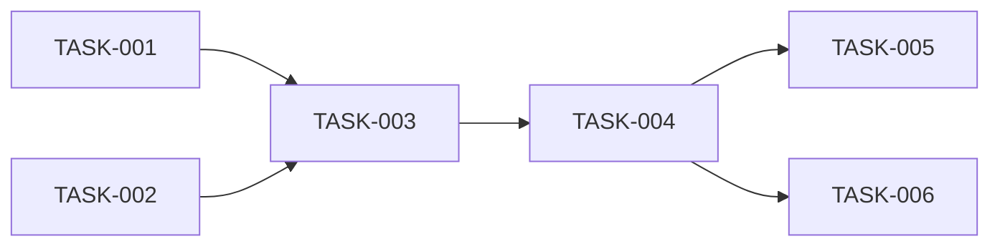

# /task-split - 分解大任務

## 用途
將複雜的大任務智能分解為可管理的小任務，提高開發效率和成功率。

## 語法
```
/task-split [task-name] [options]
```

### 參數
- `task-name`: 任務名稱或描述
- `options`:
  - `--max-size`: 每個子任務的最大複雜度 (1-10, 默認5)
  - `--strategy`: 分解策略 (sequential|parallel|hybrid)
  - `--estimate`: 包含時間估算
  - `--dependencies`: 分析任務依賴

## 分解策略

### 1. 智能分析
```python
def analyze_task_complexity(task_description):
    """分析任務複雜度"""
    
    factors = {
        'code_changes': estimate_code_changes(task_description),
        'dependencies': count_dependencies(task_description),
        'risk_level': assess_risk(task_description),
        'domain_knowledge': required_expertise(task_description),
        'testing_needs': estimate_test_requirements(task_description)
    }
    
    complexity_score = sum(factors.values()) / len(factors)
    
    return {
        'score': complexity_score,
        'factors': factors,
        'recommended_splits': math.ceil(complexity_score / 5)
    }
```

### 2. 分解算法
```python
def split_task(task, max_size=5):
    """遞歸分解任務"""
    
    complexity = analyze_task_complexity(task)
    
    if complexity['score'] <= max_size:
        return [task]  # 無需分解
    
    # 識別自然分界點
    split_points = identify_split_points(task)
    
    subtasks = []
    for point in split_points:
        subtask = extract_subtask(task, point)
        
        # 遞歸分解
        if get_complexity(subtask) > max_size:
            subtasks.extend(split_task(subtask, max_size))
        else:
            subtasks.append(subtask)
    
    return subtasks
```

### 3. 依賴分析
```python
def analyze_dependencies(subtasks):
    """分析子任務間的依賴關係"""
    
    dependency_graph = {}
    
    for task in subtasks:
        dependencies = []
        
        for other in subtasks:
            if task != other and depends_on(task, other):
                dependencies.append(other['id'])
        
        dependency_graph[task['id']] = dependencies
    
    # 拓撲排序
    execution_order = topological_sort(dependency_graph)
    
    return {
        'graph': dependency_graph,
        'order': execution_order,
        'parallel_groups': identify_parallel_groups(dependency_graph)
    }
```

## 輸出格式

### 任務分解報告
```markdown
# 任務分解: User Authentication System

## 原始任務
實現完整的用戶認證系統，包括註冊、登錄、密碼重置

## 複雜度分析
- 總複雜度: 8.5/10
- 預估時間: 16 小時
- 建議分解: 6 個子任務

## 子任務列表

### Phase 1: 基礎設施 (可並行)
1. **[TASK-001] 數據庫模型設計**
   - 複雜度: 3/10
   - 預估: 2小時
   - 依賴: 無
   
2. **[TASK-002] API 結構搭建**
   - 複雜度: 2/10
   - 預估: 1小時
   - 依賴: 無

### Phase 2: 核心功能 (順序執行)
3. **[TASK-003] 用戶註冊功能**
   - 複雜度: 4/10
   - 預估: 3小時
   - 依賴: TASK-001, TASK-002
   
4. **[TASK-004] 登錄功能**
   - 複雜度: 4/10
   - 預估: 3小時
   - 依賴: TASK-003

### Phase 3: 增強功能 (可並行)
5. **[TASK-005] 密碼重置**
   - 複雜度: 5/10
   - 預估: 4小時
   - 依賴: TASK-004
   
6. **[TASK-006] 測試套件**
   - 複雜度: 3/10
   - 預估: 3小時
   - 依賴: TASK-004

## 執行計劃


## 風險評估
- 🟡 中風險: 密碼安全性
- 🟢 低風險: 數據庫設計
- 🟡 中風險: Session 管理
```

### 可執行任務列表
```json
{
  "tasks": [
    {
      "id": "TASK-001",
      "title": "數據庫模型設計",
      "description": "設計用戶表、會話表、權限表",
      "complexity": 3,
      "estimated_hours": 2,
      "dependencies": [],
      "status": "ready",
      "assignee": null
    },
    {
      "id": "TASK-002",
      "title": "API 結構搭建",
      "description": "創建路由、中間件、控制器結構",
      "complexity": 2,
      "estimated_hours": 1,
      "dependencies": [],
      "status": "ready",
      "assignee": null
    }
  ],
  "execution_plan": {
    "parallel_groups": [
      ["TASK-001", "TASK-002"],
      ["TASK-003"],
      ["TASK-004"],
      ["TASK-005", "TASK-006"]
    ],
    "critical_path": ["TASK-001", "TASK-003", "TASK-004", "TASK-005"],
    "total_estimated_hours": 16
  }
}
```

## 分解模式庫

### 功能開發模式
```python
FEATURE_PATTERN = [
    "需求分析",
    "設計方案",
    "數據模型",
    "API 開發",
    "前端實現",
    "測試編寫",
    "文檔更新"
]
```

### 重構模式
```python
REFACTOR_PATTERN = [
    "識別問題",
    "設計新架構",
    "創建適配層",
    "漸進式遷移",
    "測試驗證",
    "清理舊代碼"
]
```

### Bug 修復模式
```python
BUGFIX_PATTERN = [
    "重現問題",
    "定位原因",
    "設計修復方案",
    "實施修復",
    "驗證修復",
    "防止回歸"
]
```

## 智能建議

### 並行機會
```python
def identify_parallel_opportunities(tasks):
    """識別可並行執行的任務"""
    
    parallel_groups = []
    current_group = []
    
    for task in tasks:
        if not has_dependencies(task) or dependencies_completed(task):
            current_group.append(task)
        else:
            if current_group:
                parallel_groups.append(current_group)
                current_group = []
    
    return parallel_groups
```

### 風險預警
```python
def assess_task_risks(task):
    """評估任務風險"""
    
    risks = []
    
    # 複雜度風險
    if task['complexity'] > 7:
        risks.append({
            'type': 'complexity',
            'level': 'high',
            'mitigation': '考慮進一步分解'
        })
    
    # 依賴風險
    if len(task['dependencies']) > 3:
        risks.append({
            'type': 'dependency',
            'level': 'medium',
            'mitigation': '確保依賴任務優先完成'
        })
    
    # 時間風險
    if task['estimated_hours'] > 8:
        risks.append({
            'type': 'duration',
            'level': 'medium',
            'mitigation': '考慮分階段實施'
        })
    
    return risks
```

## 執行整合

### 自動創建 TODO
```python
def create_todos_from_split(split_result):
    """從分解結果創建 TODO 項目"""
    
    todos = []
    
    for task in split_result['tasks']:
        todo = {
            'content': f"{task['title']}: {task['description']}",
            'status': 'pending',
            'id': task['id'],
            'metadata': {
                'complexity': task['complexity'],
                'estimated_hours': task['estimated_hours'],
                'dependencies': task['dependencies']
            }
        }
        todos.append(todo)
    
    # 使用 TodoWrite 工具
    update_todos(todos)
```

### 進度追蹤
```python
def track_split_progress(task_id):
    """追蹤分解任務的進度"""
    
    subtasks = get_subtasks(task_id)
    
    completed = sum(1 for t in subtasks if t['status'] == 'completed')
    in_progress = sum(1 for t in subtasks if t['status'] == 'in_progress')
    total = len(subtasks)
    
    progress = {
        'percentage': (completed / total) * 100,
        'completed': completed,
        'in_progress': in_progress,
        'remaining': total - completed - in_progress,
        'estimated_remaining_hours': calculate_remaining_hours(subtasks)
    }
    
    return progress
```

## 使用範例

### 基本分解
```bash
/task-split "Implement payment system"
# 自動分解為合理大小的子任務
```

### 指定粒度
```bash
/task-split "Refactor authentication" --max-size 3
# 分解為複雜度不超過 3 的小任務
```

### 包含估算
```bash
/task-split "Build dashboard" --estimate --dependencies
# 分解並提供時間估算和依賴分析
```

## 最佳實踐

### Do's ✅
- 為大於 4 小時的任務使用分解
- 識別並利用並行機會
- 保持子任務獨立性
- 定期更新進度

### Don'ts ❌
- 不要過度分解（< 1小時太細）
- 不要忽略依賴關係
- 不要跳過風險評估
- 不要混合不同類型的任務

---

*命令版本: 1.0.0*
*最後更新: 2025-01-19*