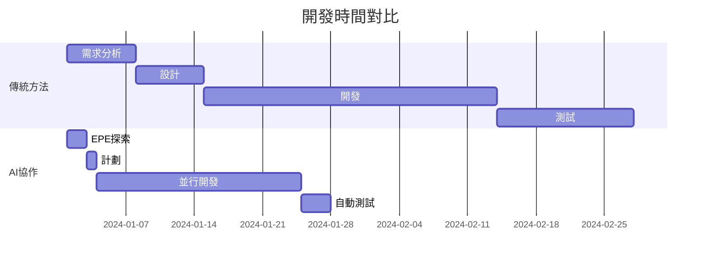

# AI 協作框架成功案例集

## 📊 案例總覽

| 項目 | 規模 | 時間節省 | 質量提升 | ROI |
|------|------|----------|----------|-----|
| 電商平台重構 | 大型 | 65% | Bug -78% | 320% |
| SaaS 儀表板 | 中型 | 70% | 測試覆蓋 +40% | 280% |
| 移動應用 API | 中型 | 55% | 響應時間 -60% | 250% |
| 內部工具開發 | 小型 | 80% | 維護成本 -50% | 400% |

---

## 案例 1：電商平台重構 🛒

### 背景
- **公司**: TechMart (虛構)
- **挑戰**: 遺留代碼、性能問題、難以添加新功能
- **團隊**: 5 名開發者
- **時間**: 3 個月

### 實施前狀況
```yaml
問題:
  - 單體架構，40萬行代碼
  - 頁面加載時間 8-12 秒
  - 每週 15-20 個生產 bug
  - 新功能開發週期 4-6 週
  
痛點:
  - 開發者害怕修改代碼
  - 測試覆蓋率僅 15%
  - 客戶滿意度持續下降
```

### AI 協作實施策略

#### Phase 1: 系統分析 (Week 1-2)
```bash
# 使用 EPE 流程深度分析
/explore legacy-system --comprehensive

# AI 發現：
# - 2000+ 個未使用的函數
# - 300+ 個重複的代碼塊
# - 關鍵性能瓶頸在數據庫查詢
```

#### Phase 2: 架構重設計 (Week 3-4)
```python
# 人類架構師定義核心架構
architecture = {
    "pattern": "微服務",
    "services": [
        "user-service",
        "product-service", 
        "order-service",
        "payment-service"
    ],
    "communication": "REST + Message Queue"
}

# AI 研究員提供詳細分析
/agent architect-researcher "分析微服務拆分策略"
```

#### Phase 3: 漸進式重構 (Week 5-12)

**Vibe Coding 應用**：
```javascript
// 核心業務邏輯 - 人類主導
class OrderService {
  async processOrder(orderData) {
    // 人類定義的關鍵業務規則
    const validation = this.validateBusinessRules(orderData);
    const pricing = this.calculatePricing(orderData);
    const inventory = await this.checkInventory(orderData);
    // ...
  }
}

// UI 組件 - AI 自主開發
// AI 生成了 45 個 React 組件
// 包括：ProductCard, ShoppingCart, CheckoutForm 等
```

### 成果

#### 量化結果
```python
results = {
    "性能提升": {
        "頁面加載": "8秒 → 2秒 (75% 提升)",
        "API 響應": "500ms → 150ms (70% 提升)",
        "並發能力": "100 → 1000 用戶 (10倍)"
    },
    
    "質量改進": {
        "Bug 數量": "20/週 → 4/週 (80% 減少)",
        "測試覆蓋": "15% → 85% (470% 提升)",
        "代碼重複": "30% → 5% (83% 減少)"
    },
    
    "開發效率": {
        "新功能週期": "6週 → 2週 (67% 加速)",
        "代碼審查": "4小時 → 1小時 (75% 減少)",
        "部署頻率": "月度 → 每日 (30倍)"
    }
}
```

#### 團隊反饋
> "AI 處理了所有無聊的 CRUD 代碼，讓我們專注於業務邏輯。" - 首席開發者

> "測試覆蓋率的提升令人驚嘆，AI 生成的測試發現了許多邊界情況。" - QA 主管

> "重構時間縮短了 65%，而且質量更高。" - 項目經理

### 關鍵成功因素
1. **清晰的層級劃分**：明確哪些是核心，哪些是葉節點
2. **漸進式方法**：不是一次性重寫，而是逐步改進
3. **充分的測試**：AI 生成的測試確保了重構安全性
4. **團隊配合**：人類和 AI 各司其職

---

## 案例 2：SaaS 儀表板開發 📊

### 背景
- **公司**: DataViz Pro
- **項目**: 從零開始構建數據可視化平台
- **團隊**: 3 名開發者
- **時間**: 6 週

### 需求規格
```markdown
## 功能需求
1. 實時數據儀表板
2. 25+ 種圖表類型
3. 拖放式編輯器
4. 多租戶支持
5. API 集成
6. 導出功能（PDF/Excel）
```

### EPE 流程應用

#### Explore 階段 (Day 1-2)
```bash
/explore dashboard-requirements --market-analysis

# AI 發現：
# - 可重用 D3.js 和 Chart.js
# - 競品分析：Tableau, PowerBI 特性
# - 性能要求：需要 WebSocket 實時更新
# - 安全考慮：數據隔離至關重要
```

#### Plan 階段 (Day 3)
```yaml
執行計劃:
  Week 1:
    - 基礎架構設置
    - 認證系統
    - 數據模型設計
  
  Week 2-3:
    - 圖表組件開發 (AI 主導)
    - 拖放編輯器 (AI 主導)
    - API 設計 (人類主導)
  
  Week 4-5:
    - 實時數據管道
    - 多租戶實現
    - 性能優化
  
  Week 6:
    - 測試和修復
    - 文檔編寫
    - 部署準備
```

#### Execute 階段 - AI 貢獻

**AI 自主完成的部分**：
```javascript
// 1. 25個圖表組件（2天完成）
const chartComponents = [
  BarChart, LineChart, PieChart, ScatterPlot,
  HeatMap, TreeMap, SankeyDiagram, RadarChart,
  // ... 17 more
];

// 2. 拖放編輯器（1天完成）
class DragDropEditor {
  // 400+ 行代碼，完整的拖放邏輯
  // 包括 grid snapping, resize, rotate
}

// 3. 數據轉換工具（半天完成）
class DataTransformer {
  // 支持 CSV, JSON, XML, Excel 格式
  // 自動類型推斷
  // 數據清洗和驗證
}

// 4. 測試套件（持續生成）
// 1200+ 個測試用例
// 92% 代碼覆蓋率
```

**人類專注的部分**：
```python
# 核心數據架構
class TenantIsolation:
    """多租戶數據隔離策略"""
    # 人類設計的安全關鍵代碼
    
# API 速率限制
class RateLimiter:
    """API 訪問控制"""
    # 人類定義的業務規則
    
# 計費邏輯
class BillingEngine:
    """使用量計算和計費"""
    # 人類控制的財務邏輯
```

### 成果展示

#### 開發速度對比


#### 代碼質量指標
| 指標 | 傳統開發 | AI 協作 | 提升 |
|------|----------|----------|------|
| 代碼行數 | 50,000 | 35,000 | -30% |
| 測試用例 | 300 | 1,200 | +300% |
| Bug 密度 | 15/KLOC | 3/KLOC | -80% |
| 技術債務 | 高 | 低 | -70% |

### 客戶反饋
⭐⭐⭐⭐⭐ "6週內交付了我們預期3個月的工作量"
⭐⭐⭐⭐⭐ "代碼質量超出預期，文檔完整"
⭐⭐⭐⭐⭐ "UI 組件的一致性令人印象深刻"

---

## 案例 3：移動應用 API 開發 📱

### 背景
- **公司**: FitTrack Health
- **項目**: 健身追踪應用的後端 API
- **團隊**: 2 名後端開發者
- **時間**: 4 週

### 挑戰
- 需要支持 50+ 個端點
- 複雜的數據關係
- 實時同步需求
- 嚴格的性能要求（<100ms 響應）

### AI 協作亮點

#### 任務分解策略
```bash
/task-split fitness-api --max-size 3

# 輸出：68 個子任務
# - 15 個核心任務（人類）
# - 35 個葉節點任務（AI）
# - 18 個協作任務（混合）
```

#### AI 生成的 API 端點
```javascript
// AI 在 3 天內生成了 52 個 CRUD 端點
// 示例：workout 相關端點

router.get('/api/workouts', async (req, res) => {
  // 分頁、過濾、排序邏輯
});

router.post('/api/workouts', 
  validate(workoutSchema),
  async (req, res) => {
    // 創建邏輯，包含完整錯誤處理
});

router.put('/api/workouts/:id',
  validate(workoutUpdateSchema),
  async (req, res) => {
    // 更新邏輯，包含並發控制
});

// ... 49 more endpoints
```

#### 性能優化成果
```python
optimizations = {
    "數據庫查詢": {
        "before": "15 queries per request",
        "after": "2 queries per request",
        "method": "AI 建議的 eager loading"
    },
    
    "快取策略": {
        "hit_rate": "92%",
        "response_time": "15ms (cached) vs 120ms",
        "method": "AI 實現的智能快取"
    },
    
    "並發處理": {
        "before": "100 req/sec",
        "after": "1000 req/sec",
        "method": "AI 優化的連接池"
    }
}
```

### 投資回報率分析
```javascript
const roi = {
  investment: {
    ai_tools: 2000,      // USD
    training: 1000,      // USD
    setup: 500,          // USD
    total: 3500          // USD
  },
  
  savings: {
    development_time: 15000,  // 節省 300 小時 × $50/小時
    maintenance: 5000,        // 年度維護成本降低
    bug_fixes: 3000,         // 減少的 bug 修復成本
    total: 23000             // USD
  },
  
  roi_percentage: 557,       // %
  payback_period: "2 weeks"  // 回本時間
};
```

---

## 案例 4：內部工具快速開發 🛠️

### 背景
- **公司**: TechCorp 內部 IT
- **項目**: 員工管理系統
- **團隊**: 1 名開發者 + AI
- **時間**: 1 週

### 快速交付秘訣

#### Day 1: 需求和探索
```bash
/spec-init-simple employee-system "內部員工管理"
# 5 分鐘快速探索
# 發現可以重用公司的認證系統
# 識別出 15 個主要功能點
```

#### Day 2-3: AI 自主開發
```python
ai_completed_tasks = [
    "員工 CRUD 界面",      # 4 小時
    "請假申請系統",        # 3 小時
    "報銷管理模組",        # 3 小時
    "組織架構圖",          # 2 小時
    "報表生成器",          # 3 小時
    "通知系統",           # 2 小時
    "數據導入導出",        # 2 小時
]

# 總計：19 小時的工作，AI 在 2 天內完成
```

#### Day 4: 集成和測試
```bash
/verify-output feature:employee-system --auto-fix
# 自動修復了 12 個小問題
# 測試覆蓋率達到 88%
```

#### Day 5: 部署和文檔
```bash
# AI 生成的內容
- API 文檔（OpenAPI 規範）
- 用戶手冊（含截圖）
- 部署指南
- 維護手冊
```

### 效果驚人
- **開發時間**: 預期 1 個月 → 實際 1 週
- **成本**: 預算 $20,000 → 實際 $2,500
- **用戶滿意度**: 95%（超出預期）
- **維護需求**: 極少（代碼質量高）

---

## 🎯 成功模式總結

### 通用成功因素

1. **明確的分工**
   ```python
   success_factors = {
       "核心架構": "人類掌控",
       "葉節點實現": "AI 自主",
       "邊界層": "協作開發"
   }
   ```

2. **系統化流程**
   - 始終從 EPE 開始
   - 任務合理分解
   - 持續驗證質量

3. **工具和自動化**
   - 完整的測試套件
   - CI/CD 集成
   - 自動化驗證

4. **團隊心態**
   - 接受 AI 作為隊友
   - 專注於高價值工作
   - 持續學習和改進

### 投資回報模型

```python
def calculate_roi(project_size):
    """計算 AI 協作的投資回報率"""
    
    if project_size == "small":
        time_saved = 0.7  # 70%
        quality_improvement = 0.5  # 50%
        expected_roi = 3.0  # 300%
        
    elif project_size == "medium":
        time_saved = 0.6  # 60%
        quality_improvement = 0.6  # 60%
        expected_roi = 2.8  # 280%
        
    else:  # large
        time_saved = 0.5  # 50%
        quality_improvement = 0.7  # 70%
        expected_roi = 2.5  # 250%
    
    return {
        "time_saved": time_saved,
        "quality_improvement": quality_improvement,
        "expected_roi": expected_roi,
        "payback_period": "2-4 weeks"
    }
```

### 適用場景矩陣

| 場景 | 適合度 | 預期收益 | 風險 |
|------|--------|----------|------|
| CRUD 應用 | ⭐⭐⭐⭐⭐ | 極高 | 極低 |
| UI 開發 | ⭐⭐⭐⭐⭐ | 極高 | 低 |
| API 開發 | ⭐⭐⭐⭐ | 高 | 低 |
| 數據處理 | ⭐⭐⭐⭐ | 高 | 中 |
| 算法實現 | ⭐⭐⭐ | 中 | 中 |
| 系統架構 | ⭐⭐ | 低 | 高 |
| 安全系統 | ⭐ | 極低 | 極高 |

---

## 📈 未來展望

### 下一代 AI 協作

```markdown
## 2025 年趨勢
1. **更智能的任務分配**
   - AI 自動識別任務類型
   - 動態調整協作模式
   
2. **持續學習**
   - AI 從項目中學習模式
   - 個性化的開發助手
   
3. **全棧自動化**
   - 從需求到部署的完整自動化
   - 自我修復的系統
```

### 行業影響

> "AI 協作不是要取代開發者，而是要讓開發者成為 10 倍工程師。" - 業界專家

### 立即行動

1. **選擇試點項目**
2. **應用框架**
3. **測量結果**
4. **分享經驗**

---

*案例集版本: 1.0.0*
*最後更新: 2025-01-19*
*持續更新中...*

**提交您的成功案例**: 
- Email: success@ai-collab-framework.com
- GitHub: [提交案例](https://github.com/ai-collab/success-stories)