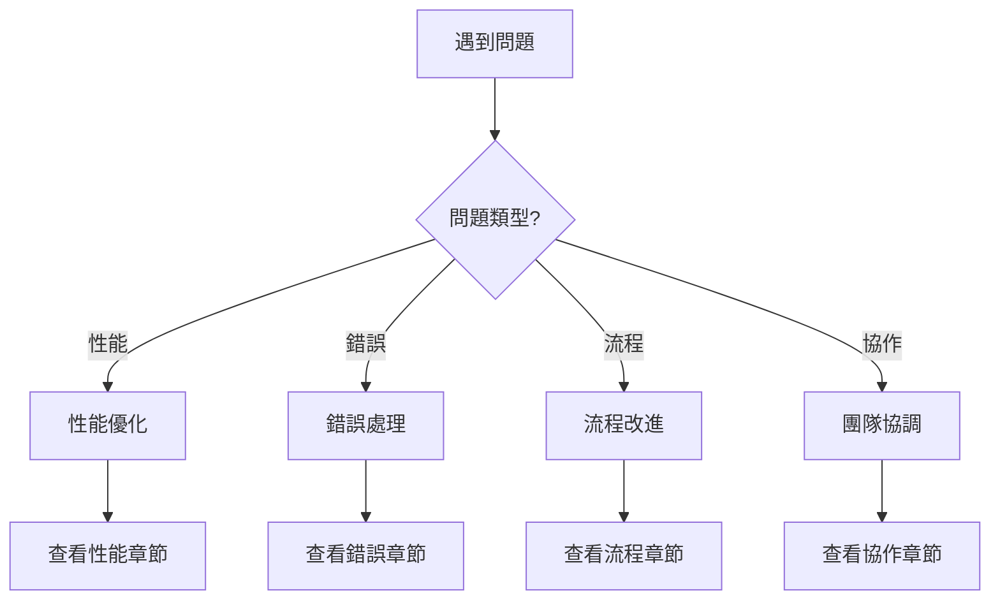

# 常見問題解決方案

## 🔍 快速診斷指南



---

## 💻 技術問題

### 問題 1：Token 使用過多

#### 症狀
- Claude 回應變慢
- 頻繁達到 token 限制
- 成本超出預算

#### 根本原因
```python
common_causes = [
    "子代理未使用研究員模式",
    "重複讀取大文件",
    "沒有使用記憶系統",
    "任務沒有合理分解"
]
```

#### 解決方案

**立即修復**：
```bash
# 1. 確認所有代理是研究員模式
ls .claude/agents/*-researcher.md | wc -l
# 應該等於代理總數

# 2. 使用記憶系統保存狀態
/memory-save checkpoint "當前進度"

# 3. 分解大任務
/task-split large-feature --max-size 3
```

**長期優化**：
```python
# 配置 token 優化策略
token_optimization = {
    "batch_operations": True,
    "cache_frequent_files": True,
    "use_summaries": True,
    "parallel_processing": True
}

# 實施最佳實踐
best_practices = [
    "使用 /explore 而非多次搜索",
    "批量讀取相關文件",
    "定期清理 session memory",
    "使用 context-push 而非重複說明"
]
```

#### 預期效果
- Token 使用減少 50-70%
- 響應速度提升 2-3 倍
- 成本降低 60%

---

### 問題 2：AI 生成的代碼質量不佳

#### 症狀
- 代碼不符合項目風格
- 缺少錯誤處理
- 性能問題
- 測試不完整

#### 診斷檢查
```bash
# 運行代碼質量檢查
/verify-output last --level strict

# 檢查測試覆蓋率
npm test -- --coverage

# 運行 linter
npm run lint
```

#### 解決方案

**改進指令質量**：
```markdown
## ❌ 不好的指令
"創建一個用戶登錄功能"

## ✅ 好的指令
"創建用戶登錄 API 端點：
- 使用 JWT token
- 包含速率限制（5次/15分鐘）
- 密碼使用 bcrypt (12 rounds)
- 返回格式參考 existing-api.md
- 包含單元測試（覆蓋率 >80%）
- 遵循項目 ESLint 規則"
```

**提供上下文**：
```bash
# 1. 提供範例代碼
/context-push discovery "參考 src/api/existing-endpoint.js 的模式"

# 2. 明確質量要求
/context-push requirement "所有 API 必須包含：
- 輸入驗證
- 錯誤處理
- 日誌記錄
- 性能監控"

# 3. 設置驗證級別
/verify-output feature --level strict --auto-fix
```

**使用模板**：
```javascript
// 創建項目模板
// .claude/templates/api-endpoint.template.js
module.exports = {
  template: `
router.post('{{path}}',
  authenticate,
  authorize('{{permission}}'),
  validate({{schema}}),
  rateLimit({{limits}}),
  async (req, res, next) => {
    try {
      // Implementation here
    } catch (error) {
      next(error);
    }
  }
);`,
  
  requirements: [
    "authentication",
    "authorization",
    "validation",
    "rate limiting",
    "error handling"
  ]
};
```

---

### 問題 3：探索階段耗時過長

#### 症狀
- /explore 命令超過 30 分鐘
- 搜索結果過多
- 分析報告冗長

#### 優化策略

**限制搜索範圍**：
```bash
# 使用時間限制
/explore feature --time-limit 15m

# 指定搜索目錄
/explore feature --path src/modules/related

# 使用快速模式
/explore feature --quick
```

**預先準備**：
```python
# 創建探索檢查清單
exploration_checklist = {
    "明確目標": "要解決什麼問題？",
    "縮小範圍": "只搜索相關目錄",
    "設置限制": "最多 15 分鐘",
    "關鍵詞準備": ["keyword1", "keyword2"],
    "預期發現": "希望找到什麼？"
}
```

**使用快取**：
```bash
# 利用之前的探索結果
/memory-query exploration-cache

# 增量探索
/explore feature --incremental
```

---

## 🔄 流程問題

### 問題 4：任務規劃不合理

#### 症狀
- 任務依賴混亂
- 估時不準確
- 頻繁返工

#### 診斷工具
```python
def diagnose_planning_issues(plan):
    issues = []
    
    # 檢查任務粒度
    if any(task.estimated_hours > 8 for task in plan.tasks):
        issues.append("任務過大，需要分解")
    
    # 檢查依賴關係
    if has_circular_dependencies(plan):
        issues.append("存在循環依賴")
    
    # 檢查並行機會
    if parallel_efficiency(plan) < 0.3:
        issues.append("並行度不足")
    
    return issues
```

#### 改進方法

**使用智能分解**：
```bash
# 自動分解大任務
/task-split complex-feature --smart

# 分析依賴關係
/plan feature --analyze-dependencies

# 優化執行順序
/plan feature --optimize-sequence
```

**模板化規劃**：
```yaml
# .claude/planning-templates/standard.yaml
phases:
  - name: "基礎設施"
    duration: "20%"
    parallel: true
    
  - name: "核心功能"
    duration: "50%"
    parallel: false
    
  - name: "測試優化"
    duration: "20%"
    parallel: true
    
  - name: "文檔部署"
    duration: "10%"
    parallel: true
```

---

### 問題 5：驗證不夠全面

#### 症狀
- 生產環境出現 bug
- 性能問題被忽視
- 安全漏洞

#### 強化驗證

**分層驗證策略**：
```bash
# Level 1: 基礎驗證（所有代碼）
/verify-output all --level basic

# Level 2: 標準驗證（功能代碼）
/verify-output feature --level standard

# Level 3: 嚴格驗證（核心代碼）
/verify-output core --level strict

# Level 4: 安全審計（敏感代碼）
/verify-output security --audit
```

**自動化驗證管道**：
```yaml
# .github/workflows/verification.yml
name: Multi-Layer Verification

on: [push, pull_request]

jobs:
  basic:
    runs-on: ubuntu-latest
    steps:
      - uses: actions/checkout@v2
      - run: npm run lint
      - run: npm run type-check
      
  standard:
    needs: basic
    steps:
      - run: npm test
      - run: npm run test:integration
      
  strict:
    needs: standard
    if: github.base_ref == 'main'
    steps:
      - run: npm run test:e2e
      - run: npm run security:scan
      - run: npm run performance:test
```

---

## 👥 協作問題

### 問題 6：團隊抗拒使用 AI

#### 常見擔憂
- "AI 會取代我的工作"
- "AI 代碼質量不可靠"
- "學習成本太高"
- "失去對代碼的控制"

#### 解決策略

**教育和培訓**：
```markdown
## 培訓計劃
1. **Week 1**: AI 協作基礎概念
   - Vibe Coding 理念
   - 人類 vs AI 角色
   
2. **Week 2**: 實踐練習
   - 葉節點任務實踐
   - 驗證和測試
   
3. **Week 3**: 進階技巧
   - EPE 工作流程
   - 性能優化
   
4. **Week 4**: 項目實戰
   - 真實項目應用
   - 問題解決
```

**逐步引入**：
```python
adoption_phases = [
    {
        "phase": 1,
        "scope": "測試代碼生成",
        "risk": "極低",
        "duration": "1 週"
    },
    {
        "phase": 2,
        "scope": "UI 組件開發",
        "risk": "低",
        "duration": "2 週"
    },
    {
        "phase": 3,
        "scope": "API 開發",
        "risk": "中",
        "duration": "2 週"
    },
    {
        "phase": 4,
        "scope": "完整功能開發",
        "risk": "中",
        "duration": "持續"
    }
]
```

**展示成功案例**：
- 內部試點項目
- 度量改進指標
- 分享成功經驗
- 慶祝小勝利

---

### 問題 7：多實例協作混亂

#### 症狀
- 代碼衝突頻繁
- 重複工作
- 溝通不暢

#### 協調機制

**明確分工**：
```yaml
# .claude/team-allocation.yaml
instances:
  instance-1:
    name: "Frontend Developer"
    focus: "UI components"
    branch: "feature/ui"
    paths: ["src/components", "src/styles"]
    
  instance-2:
    name: "Backend Developer"
    focus: "API development"
    branch: "feature/api"
    paths: ["src/api", "src/services"]
    
  instance-3:
    name: "Test Engineer"
    focus: "Testing"
    branch: "feature/tests"
    paths: ["tests", "cypress"]
```

**同步機制**：
```bash
# 定期同步腳本
#!/bin/bash
# .claude/scripts/sync-instances.sh

# 1. 更新共享記憶
python .claude/scripts/memory_sync.py --type all

# 2. 合併分支
git fetch --all
git merge origin/feature/ui --no-edit
git merge origin/feature/api --no-edit

# 3. 運行集成測試
npm run test:integration

# 4. 更新狀態
/context-push update "同步完成: $(date)"
```

---

## 🚀 性能問題

### 問題 8：開發速度未達預期

#### 診斷檢查
```python
def performance_diagnostic():
    metrics = {
        "token_efficiency": check_token_usage(),
        "parallel_utilization": check_parallel_tasks(),
        "cache_hit_rate": check_cache_effectiveness(),
        "verification_time": measure_verification_time()
    }
    
    bottlenecks = identify_bottlenecks(metrics)
    return bottlenecks
```

#### 優化建議

**並行化策略**：
```python
# 識別可並行任務
parallel_opportunities = [
    "UI 開發 + API 開發",
    "單元測試 + 文檔編寫",
    "代碼審查 + 部署準備"
]

# 使用多個 worktree
setup_parallel_development = """
git worktree add ../ui feature/ui
git worktree add ../api feature/api
git worktree add ../tests feature/tests
"""
```

**批量操作**：
```python
# ❌ 低效方式
for file in files:
    read_file(file)
    process_file(file)

# ✅ 高效方式
files_content = batch_read(files)
results = parallel_process(files_content)
```

**智能快取**：
```python
# 實施快取策略
cache_config = {
    "session_cache": {
        "ttl": 3600,
        "size": "100MB"
    },
    "file_cache": {
        "patterns": ["*.config.js", "*.json"],
        "ttl": 86400
    },
    "result_cache": {
        "operations": ["explore", "plan"],
        "ttl": 7200
    }
}
```

---

## 📋 快速解決方案清單

### 立即可執行的修復

| 問題 | 快速修復命令 | 預期效果 |
|------|-------------|----------|
| Token 過多 | `/memory-save && /task-split` | -50% token |
| 代碼質量差 | `/verify-output --auto-fix` | 修復 80% 問題 |
| 探索太慢 | `/explore --quick --limit 10m` | 節省 20分鐘 |
| 規劃混亂 | `/plan --template standard` | 結構化計劃 |
| 測試不足 | `/verify --generate-tests` | +40% 覆蓋率 |

### 預防措施檢查清單

- [ ] 每日檢查 token 使用統計
- [ ] 每週審查代碼質量指標
- [ ] 每次迭代後回顧流程
- [ ] 定期團隊同步會議
- [ ] 持續更新最佳實踐

---

## 🆘 緊急支援

### 嚴重問題升級路徑

1. **Level 1**: 查看本文檔
2. **Level 2**: 搜索 GitHub Issues
3. **Level 3**: 社區論壇求助
4. **Level 4**: 提交 Bug Report
5. **Level 5**: 緊急支援熱線

### 診斷信息收集

```bash
# 收集診斷信息腳本
#!/bin/bash
echo "=== 診斷信息 ===" > diagnostic.txt
echo "Date: $(date)" >> diagnostic.txt
echo "Version: $(claude-code --version)" >> diagnostic.txt
echo "Token Usage: $(claude-code stats --token)" >> diagnostic.txt
echo "Error Logs:" >> diagnostic.txt
tail -n 50 ~/.claude/logs/error.log >> diagnostic.txt
echo "Configuration:" >> diagnostic.txt
cat .claude/settings.json >> diagnostic.txt
```

### 社區資源

- 📚 [知識庫](https://kb.ai-collab.com)
- 💬 [Discord 社區](https://discord.gg/ai-collab)
- 📹 [視頻教程](https://youtube.com/ai-collab)
- 📧 [郵件列表](https://groups.google.com/ai-collab)

---

*文檔版本: 1.0.0*
*最後更新: 2025-01-19*
*持續改進中...*

**發現新問題？** 請[提交到問題庫](https://github.com/ai-collab/issues)