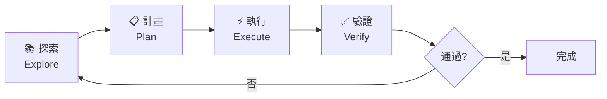

# 探索-計畫-執行 (EPE) 工作流程

基於 Claude Code 專家用戶的最佳實踐，EPE 工作流程是確保 AI 協作成功的關鍵模式。

## 核心理念

> "Context is everything" - 上下文就是一切

在開始編碼之前，充分的探索和周密的計畫可以將成功率從 60% 提升到 95% 以上。

## 三階段工作流程



## 階段一：探索 (Explore)

### 目標
讓 AI 充分理解：
- 程式碼庫結構
- 現有設計模式
- 業務需求背景
- 技術約束條件

### 探索指令範例

```bash
# 1. 理解專案結構
"請探索這個專案的整體架構，特別關注 [特定模組]"

# 2. 尋找相似實作
"找出專案中類似的功能實作，分析其模式"

# 3. 理解業務邏輯
"解釋 [功能名稱] 的業務邏輯和數據流"

# 4. 識別依賴關係
"分析 [模組名稱] 的依賴關係和影響範圍"
```

### 探索技巧

**深度優於廣度**：
```markdown
❌ 錯誤："了解整個專案"
✅ 正確："深入了解用戶認證模組，包括其與資料庫和 API 的互動"
```

**使用具體問題引導**：
```markdown
- "這個功能的入口點在哪裡？"
- "錯誤處理是如何實現的？"
- "有哪些安全考量？"
- "性能瓶頸可能在哪裡？"
```

### 探索成果文檔

保存到 `.kiro/research/exploration/[date]-[topic].md`：

```markdown
# [功能] 探索報告

## 發現總結
- 關鍵發現 1
- 關鍵發現 2
- 關鍵發現 3

## 程式碼結構
### 相關檔案
- `path/to/file1.py`: [用途描述]
- `path/to/file2.js`: [用途描述]

### 現有模式
- 模式 1: [描述和位置]
- 模式 2: [描述和位置]

## 技術考量
- 使用的框架：
- 依賴套件：
- 設計決策：

## 潛在挑戰
- 挑戰 1: [描述和建議]
- 挑戰 2: [描述和建議]
```

## 階段二：計畫 (Plan)

### 目標
制定清晰、可執行的實施計畫：
- 分解任務為可管理的步驟
- 識別風險和依賴
- 定義成功標準
- 估算時間和資源

### 計畫指令範例

```bash
# 1. 高層次設計
"基於探索結果，設計 [功能] 的實施方案，不要開始編碼"

# 2. 詳細計畫
"制定詳細的實施計畫，包括具體步驟、需要修改的檔案和測試策略"

# 3. 風險評估
"評估這個計畫的風險和潛在問題，提供緩解策略"

# 4. 任務分解
"將這個功能分解為可獨立完成的子任務"
```

### 計畫模板

```markdown
# [功能] 實施計畫

## 概述
[簡短描述要實現的功能]

## 實施策略
[採用的技術方案和架構決策]

## 任務分解
### Phase 1: 基礎設施
- [ ] 任務 1.1: [描述] (預估: 30min)
- [ ] 任務 1.2: [描述] (預估: 1hr)

### Phase 2: 核心功能
- [ ] 任務 2.1: [描述] (預估: 2hr)
- [ ] 任務 2.2: [描述] (預估: 1hr)

### Phase 3: 測試與優化
- [ ] 任務 3.1: 編寫單元測試 (預估: 1hr)
- [ ] 任務 3.2: 性能優化 (預估: 30min)

## 檔案變更清單
- `CREATE`: path/to/new/file.py
- `MODIFY`: path/to/existing/file.js
- `DELETE`: path/to/old/file.css

## 依賴和前置條件
- [ ] 安裝套件：package-name
- [ ] 環境變數：ENV_VAR_NAME
- [ ] 資料庫遷移：migration-description

## 成功標準
- [ ] 功能測試全部通過
- [ ] 性能指標達標 (<200ms)
- [ ] 無安全漏洞
- [ ] 程式碼覆蓋率 >80%

## 風險與緩解
| 風險 | 影響 | 可能性 | 緩解策略 |
|------|------|--------|----------|
| 風險1 | 高 | 中 | 策略描述 |
| 風險2 | 中 | 低 | 策略描述 |
```

### 計畫驗證

在批准計畫前，使用「第二意見」技巧：

```bash
# 開啟新的 Claude 實例
"我的開發團隊提出了以下計畫 [貼上計畫]，請評估其可行性和潛在問題"
```

## 階段三：執行 (Execute)

### 目標
基於計畫，高效且正確地實施功能：
- 遵循既定計畫
- 保持程式碼品質
- 頻繁測試驗證
- 及時調整策略

### 執行指令範例

```bash
# 1. 開始實施
"根據計畫，開始實施 Phase 1 的任務"

# 2. 測試驅動
"先為 [功能] 編寫測試，然後實施使測試通過"

# 3. 迭代改進
"運行測試並修復發現的問題"

# 4. 程式碼審查
"審查剛完成的實施，確保符合專案規範"
```

### 執行最佳實踐

**小步快跑**：
```markdown
1. 實施一個小功能
2. 立即測試
3. 提交變更
4. 繼續下一個
```

**保持可追溯性**：
```bash
# 每完成一個重要步驟就提交
git add .
git commit -m "feat: 完成用戶認證基礎架構"
```

**即時驗證**：
```javascript
// 在實施過程中加入驗證點
console.log('✓ Step 1: Database connection established');
console.log('✓ Step 2: User model created');
console.log('✓ Step 3: Authentication middleware configured');
```

### 執行監控

使用待辦事項列表追蹤進度：

```markdown
## 當前進度
- [x] 任務 1.1: 建立資料庫連接
- [x] 任務 1.2: 創建用戶模型
- [▶] 任務 2.1: 實作認證邏輯  <- 進行中
- [ ] 任務 2.2: 添加授權中間件
- [ ] 任務 3.1: 編寫測試
```

## 工具整合

### 1. 自定義命令

在 `.claude/commands/` 創建 EPE 命令：

```markdown
# explore.md
開始探索階段。深入理解 {{FEATURE}} 相關的程式碼和需求。

# plan.md
基於探索結果，為 {{FEATURE}} 制定詳細實施計畫。

# execute.md
根據已批准的計畫，開始實施 {{FEATURE}}。
```

### 2. Claude.md 配置

```markdown
# CLAUDE.md

## 工作流程
我們使用 EPE (探索-計畫-執行) 工作流程：
1. 探索：充分理解需求和現有程式碼
2. 計畫：制定詳細實施計畫並獲得批准
3. 執行：根據計畫進行實施

## 重要原則
- 永遠不要跳過探索階段
- 計畫必須獲得批准才能執行
- 執行時頻繁測試和提交
```

### 3. 整合子代理

```bash
# 探索階段使用研究型子代理
"啟動 architecture-researcher 子代理，探索認證系統架構"

# 計畫階段使用規劃型子代理
"啟動 tech-lead 子代理，審查並優化實施計畫"

# 執行階段保持父代理控制
"根據計畫直接實施，不要委派給子代理"
```

## 成功案例

### 案例：實作支付系統

**探索階段** (2 小時)：
- 研究現有訂單系統
- 了解 Stripe API
- 分析安全需求

**計畫階段** (1 小時)：
- 設計支付流程
- 規劃資料庫更改
- 制定測試策略

**執行階段** (4 小時)：
- 實作支付邏輯
- 整合前端
- 完成測試

**結果**：
- 首次嘗試成功率：95%
- 返工時間：< 30 分鐘
- 總時間節省：60%

## 常見陷阱與解決方案

### 陷阱 1：跳過探索階段
**症狀**：AI 做出錯誤假設，產生不符合專案風格的程式碼
**解決**：強制執行探索步驟，即使看起來簡單的任務

### 陷阱 2：計畫過於模糊
**症狀**：執行時頻繁偏離軌道
**解決**：要求具體到檔案和函數級別的計畫

### 陷阱 3：執行時失去上下文
**症狀**：AI 忘記之前的決策
**解決**：使用檔案系統保存計畫，執行時頻繁參考

## 效能指標

成功的 EPE 實施應該達到：
- 探索階段：識別 80% 以上的相關程式碼
- 計畫階段：90% 的任務在預估時間內完成
- 執行階段：首次成功率 > 85%
- 整體：返工率 < 20%

## 總結

EPE 工作流程透過結構化的方法，將 AI 的強大能力與人類的監督和指導相結合。記住：

> **花在探索和計畫上的時間，會在執行時獲得 10 倍的回報。**

透過充分的前期投入，我們可以讓 AI 成為真正高效的開發夥伴，而非僅僅是程式碼生成器。