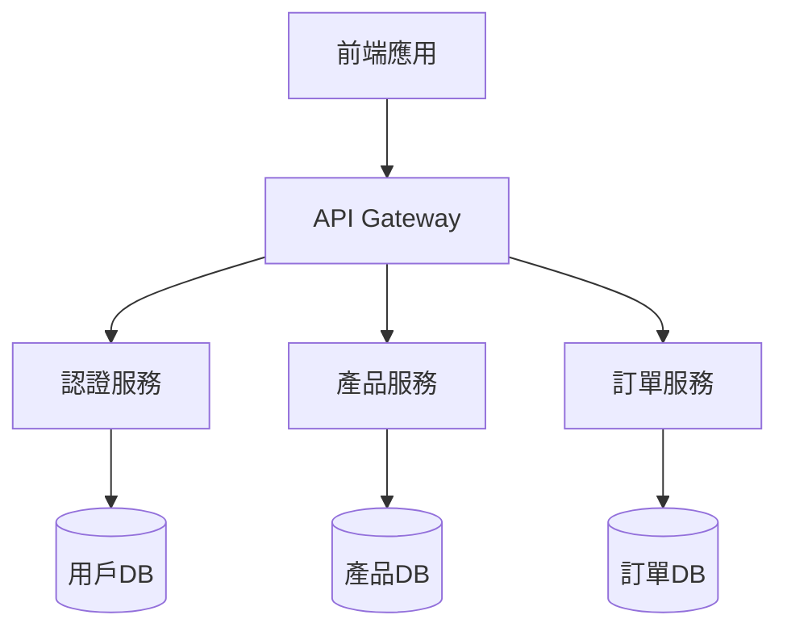

# 記憶系統增強方案

基於 Claude Code 社群經驗，建立一個分層、持久化的記憶系統，優化 AI 協作的上下文管理。

## 系統架構

```
專案根目錄/
├── .claude/                    # Claude 配置
│   └── memory.md               # 即時記憶（自動載入）
├── .kiro/                      # 知識庫
│   ├── memory/                 # 持久記憶層
│   │   ├── global/            # 全域記憶
│   │   │   ├── patterns.md   # 程式碼模式
│   │   │   ├── decisions.md  # 架構決策
│   │   │   └── lessons.md    # 經驗教訓
│   │   ├── project/           # 專案記憶
│   │   │   ├── overview.md   # 專案概覽
│   │   │   ├── roadmap.md    # 發展路線
│   │   │   └── changelog.md  # 變更歷史
│   │   └── session/           # 會話記憶
│   │       ├── active.md     # 當前會話
│   │       └── archive/      # 歷史會話
│   ├── context/               # 上下文文檔
│   │   ├── current.md        # 當前任務上下文
│   │   └── stack.md          # 上下文堆疊
│   └── research/              # 研究成果
│       └── [date]/           # 按日期組織
└── CLAUDE.md                  # 主配置文件
```

## 記憶層級詳解

### 1. 即時記憶 (Immediate Memory)

**文件**：`.claude/memory.md`
**特點**：每次對話自動載入
**內容**：當前會話的關鍵信息

```markdown
# 即時記憶

## 當前任務
- 實作用戶認證系統
- 使用 JWT tokens
- 整合 OAuth2

## 重要決策
- 決定使用 Passport.js
- Token 過期時間：24小時
- 資料庫：PostgreSQL

## 待處理問題
- [ ] 處理 token 刷新邏輯
- [ ] 添加雙因素認證

## 相關文件
- 詳細計畫：.kiro/specs/auth/plan.md
- 研究報告：.kiro/research/2024-01-15/oauth-research.md
```

### 2. 專案記憶 (Project Memory)

**目錄**：`.kiro/memory/project/`
**特點**：跨會話持久化
**內容**：專案級別的知識和決策

```markdown
# overview.md - 專案概覽

## 專案資訊
- 名稱：E-commerce Platform
- 版本：2.0.0
- 開始日期：2024-01-01

## 技術棧
- 前端：React + TypeScript
- 後端：Node.js + Express
- 資料庫：PostgreSQL
- 快取：Redis

## 核心架構


## 關鍵決策記錄
| 日期 | 決策 | 原因 | 影響 |
|------|------|------|------|
| 2024-01-15 | 採用微服務架構 | 可擴展性需求 | 需要服務發現機制 |
| 2024-02-01 | 使用 JWT 認證 | 無狀態、可擴展 | 需要 token 刷新機制 |
```

### 3. 全域記憶 (Global Memory)

**目錄**：`.kiro/memory/global/`
**特點**：跨專案共享
**內容**：通用模式和最佳實踐

```markdown
# patterns.md - 程式碼模式

## API 設計模式
### RESTful 端點命名
- GET /api/resources - 列表
- GET /api/resources/:id - 詳情
- POST /api/resources - 創建
- PUT /api/resources/:id - 更新
- DELETE /api/resources/:id - 刪除

## 錯誤處理模式
```javascript
// 統一錯誤格式
class AppError extends Error {
  constructor(message, statusCode, code) {
    super(message);
    this.statusCode = statusCode;
    this.code = code;
    this.isOperational = true;
  }
}

// 全域錯誤處理
app.use((err, req, res, next) => {
  const { statusCode = 500, message } = err;
  res.status(statusCode).json({
    success: false,
    error: { message, code: err.code }
  });
});
```

## 測試模式
- 單元測試：Jest
- 整合測試：Supertest
- E2E 測試：Cypress
- 覆蓋率目標：80%
```

### 4. 會話記憶 (Session Memory)

**目錄**：`.kiro/memory/session/`
**特點**：單次會話範圍
**內容**：當前工作狀態

```markdown
# active.md - 活躍會話

## 會話資訊
- ID: session-2024-01-15-001
- 開始時間：2024-01-15 09:00
- 最後更新：2024-01-15 14:30

## 工作進度
### 已完成
- [x] 設計認證流程
- [x] 實作用戶模型
- [x] 創建註冊 API

### 進行中
- [ ] 實作登入邏輯 (70%)
  - [x] 密碼驗證
  - [x] Token 生成
  - [ ] Refresh token

### 待處理
- [ ] OAuth2 整合
- [ ] 雙因素認證
- [ ] 密碼重置功能

## 上下文堆疊
1. 根任務：實作完整認證系統
2. 當前焦點：JWT token 管理
3. 子任務：處理 token 過期

## 重要發現
- Passport.js 與 TypeScript 整合需要額外類型定義
- Redis 用於 token 黑名單比資料庫查詢快 10 倍
- 需要考慮 CORS 配置for前端整合
```

## 記憶管理命令

### 1. 記憶操作命令

```bash
# 保存當前狀態到記憶
/memory-save "完成認證基礎實作"

# 載入特定記憶
/memory-load project/overview

# 更新記憶
/memory-update session/active "添加新發現"

# 歸檔當前會話
/memory-archive
```

### 2. 上下文切換

```bash
# 推入新上下文
/context-push "開始實作支付功能"

# 彈出上下文
/context-pop

# 查看上下文堆疊
/context-stack
```

### 3. 知識查詢

```bash
# 搜索記憶
/memory-search "認證"

# 列出所有記憶
/memory-list

# 顯示記憶統計
/memory-stats
```

## 自動化記憶管理

### 1. Git Hooks 整合

```bash
# .git/hooks/post-commit
#!/bin/bash
# 自動更新變更日誌
echo "## $(date '+%Y-%m-%d %H:%M')" >> .kiro/memory/project/changelog.md
git log -1 --pretty=format:"- %s%n" >> .kiro/memory/project/changelog.md
```

### 2. 定期歸檔腳本

```python
# scripts/archive_memory.py
import os
import shutil
from datetime import datetime

def archive_session():
    """歸檔當前會話記憶"""
    current = '.kiro/memory/session/active.md'
    if os.path.exists(current):
        timestamp = datetime.now().strftime('%Y%m%d_%H%M%S')
        archive_path = f'.kiro/memory/session/archive/{timestamp}.md'
        shutil.move(current, archive_path)
        print(f"Session archived to {archive_path}")

if __name__ == "__main__":
    archive_session()
```

### 3. 記憶壓縮策略

```python
# scripts/compress_memory.py
def compress_memory(memory_file, max_size=5000):
    """壓縮記憶文件，保留關鍵信息"""
    with open(memory_file, 'r') as f:
        content = f.read()
    
    if len(content) > max_size:
        # 使用 AI 生成摘要
        summary = generate_summary(content)
        
        # 保存原始版本
        backup_file = memory_file.replace('.md', '_full.md')
        shutil.copy(memory_file, backup_file)
        
        # 寫入壓縮版本
        with open(memory_file, 'w') as f:
            f.write(summary)
            f.write(f"\n\n*完整版本：{backup_file}*")
```

## 最佳實踐

### 1. 記憶粒度控制

**太細**：
```markdown
❌ - 修改了第 15 行的變數名
❌ - 添加了一個分號
```

**適中**：
```markdown
✅ - 完成用戶認證模組
✅ - 解決了 token 過期問題
```

### 2. 記憶分類原則

| 類型 | 存放位置 | 保留時間 | 範例 |
|------|----------|----------|------|
| 架構決策 | global/decisions | 永久 | 選擇微服務架構 |
| 程式碼模式 | global/patterns | 永久 | 錯誤處理模式 |
| 專案規範 | project/overview | 專案生命週期 | 技術棧選擇 |
| 功能計畫 | project/roadmap | 直到完成 | Q1 開發計畫 |
| 工作進度 | session/active | 單次會話 | 當前任務狀態 |
| 臨時筆記 | .claude/memory | 即時 | 剛發現的 bug |

### 3. 記憶引用模式

```markdown
# 在 CLAUDE.md 中引用其他記憶
## 相關記憶
- 架構決策：@(.kiro/memory/global/decisions.md)
- 專案概覽：@(.kiro/memory/project/overview.md)
- 當前任務：@(.kiro/memory/session/active.md)
```

## 與子代理的協作

### 1. 記憶共享協議

```markdown
# 子代理啟動時
1. 讀取 .kiro/context/current.md
2. 載入相關的 project 和 global 記憶
3. 創建自己的工作記憶

# 子代理完成時
1. 更新 .kiro/context/current.md
2. 保存研究成果到 .kiro/research/
3. 更新 session/active.md 的進度
```

### 2. 記憶隔離級別

```python
# 配置子代理的記憶訪問權限
AGENT_MEMORY_ACCESS = {
    'researcher': ['read_all', 'write_research'],
    'implementer': ['read_all', 'write_session'],
    'reviewer': ['read_all', 'write_global_patterns'],
}
```

## 效能優化

### 1. 記憶載入優化

```python
# 智能載入策略
def load_relevant_memory(task_type):
    """根據任務類型載入相關記憶"""
    memories = []
    
    # 總是載入
    memories.append('.claude/memory.md')
    memories.append('.kiro/memory/session/active.md')
    
    # 條件載入
    if 'architecture' in task_type:
        memories.append('.kiro/memory/global/decisions.md')
    if 'implementation' in task_type:
        memories.append('.kiro/memory/global/patterns.md')
    
    return memories
```

### 2. 記憶快取

```javascript
// 使用 Redis 快取頻繁訪問的記憶
const MemoryCache = {
  async get(key) {
    // 先檢查 Redis
    let memory = await redis.get(key);
    if (!memory) {
      // 從檔案系統讀取
      memory = await fs.readFile(key);
      // 快取 1 小時
      await redis.setex(key, 3600, memory);
    }
    return memory;
  }
};
```

## 監控和維護

### 1. 記憶健康檢查

```bash
# 檢查記憶系統狀態
/memory-health

輸出：
記憶系統狀態報告
================
總記憶文件：42
總大小：156 KB
最大文件：.kiro/memory/project/overview.md (12 KB)
最舊記憶：2024-01-01
孤立記憶：3 個（建議清理）
壓縮建議：2 個文件超過 10 KB
```

### 2. 定期維護任務

```yaml
# .github/workflows/memory-maintenance.yml
name: Memory Maintenance
on:
  schedule:
    - cron: '0 0 * * 0' # 每週日午夜
jobs:
  maintain:
    steps:
      - name: Archive old sessions
        run: python scripts/archive_old_sessions.py
      - name: Compress large memories
        run: python scripts/compress_memory.py
      - name: Generate memory report
        run: python scripts/memory_report.py
```

## 總結

有效的記憶系統是 AI 協作成功的關鍵。透過分層管理、智能載入和自動維護，我們可以：

1. **減少上下文窗口消耗**：只載入相關記憶
2. **提高工作連續性**：跨會話保持狀態
3. **加速問題解決**：快速找到相關經驗
4. **促進知識共享**：團隊共享最佳實踐

記住：**記憶不是為了記住一切，而是為了記住正確的事情。**