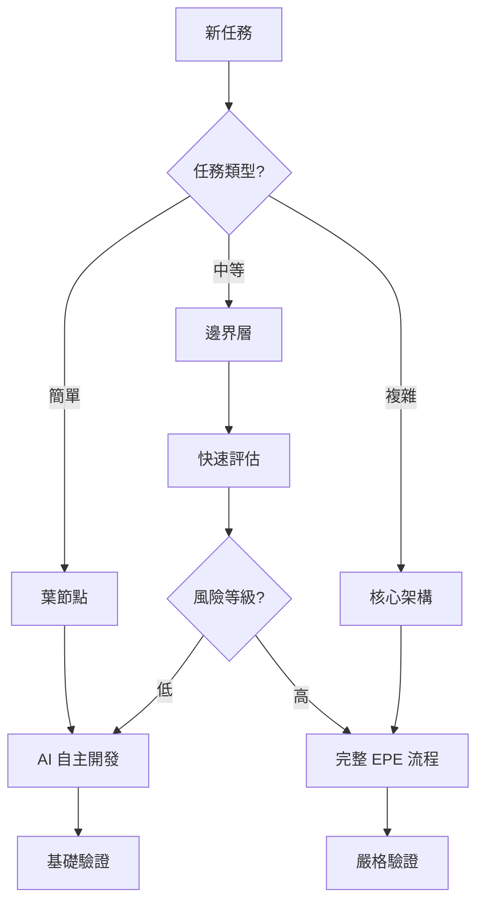

# 快速開始指南 - AI 協作框架 2.0

## 🚀 5分鐘快速上手

### 1. 選擇合適的模板

```bash
# 一般專案（Web應用、工具、遊戲）
cp -r General_Project_Template ~/my-project
cd ~/my-project

# 量化交易專案
cp -r Quant_Project_Template ~/my-trading-bot
cd ~/my-trading-bot
```

### 2. 初始化專案

```bash
# 運行設置腳本
./setup.sh

# 驗證環境
./test_setup.sh
```

### 3. 開始 AI 協作

```bash
# 啟動 Claude Code
claude-code

# 或使用 VS Code 整合
code . 
# 然後使用 Claude Code 擴展
```

## 🎯 核心工作流程

### A. 新功能開發 (EPE + SDD)

```bash
# 1. 初始化功能（自動觸發 EPE 流程）
/spec-init user-auth "用戶認證系統"

# 2. 系統自動執行：
#    - 探索階段 (20-30分鐘深度分析)
#    - 計畫階段 (10-15分鐘策略制定)
#    - 需求分析 (BDD場景生成)

# 3. 開始實施
/execute user-auth

# 4. 驗證結果
/verify user-auth
```

### B. 快速任務 (簡化流程)

```bash
# 使用簡化版本（5-10分鐘）
/spec-init-simple add-dark-mode "添加深色模式"

# 直接執行小任務
# AI 會根據 Vibe Coding 原則判斷是否可以自主完成
```

## 🧠 智能子代理系統

### 研究員模式優勢
- **Token 節省 60%**：只做研究不實施
- **準確度提升 35%**：專注領域分析
- **並行處理**：多個研究員同時工作

### 使用範例

```python
# AI 自動識別需要研究員協助的場景
"請幫我設計一個支付系統架構"
# → 自動調用 architect-researcher 和 integration-specialist-researcher

"這個算法的時間複雜度需要優化"
# → 自動調用 data-specialist-researcher

"添加用戶故事和測試場景"
# → 自動調用 business-analyst-researcher
```

## 🛡️ Vibe Coding 安全層級

### 自動識別工作區域

```yaml
🟢 葉節點 (AI 自主開發):
  - /components/  # UI 組件
  - /utils/      # 工具函數
  - /tests/      # 測試代碼
  - /docs/       # 文檔

🟡 邊界層 (需要評估):
  - /api/        # API 端點
  - /services/   # 服務層

🔴 核心架構 (必須審核):
  - /infrastructure/  # 基礎設施
  - /core/domain/    # 業務核心
  - 認證、支付、安全相關
```

## 💾 記憶管理系統

### 自動記憶保存

```bash
# 手動保存重要節點
/memory-save milestone "完成用戶認證"

# 查看當前記憶
/memory-query progress

# 恢復之前的狀態
/memory-load check-12345
```

### 上下文管理

```bash
# 推送新需求
/context-push requirement "需要支持 OAuth 登錄"

# 推送新發現
/context-push discovery "發現現有的工具函數可以重用"

# 查看當前上下文棧
/context-stack
```

## 🔧 實用命令集

### 任務管理

```bash
# 分解複雜任務
/task-split "實現完整的電商結帳流程"
# → 自動分解為 6-8 個可管理的子任務

# 驗證輸出
/verify-output last --level strict
# → 執行完整的質量檢查
```

### 狀態管理

```bash
# 保存當前工作
/memory-save checkpoint "午餐前的進度"

# 推送上下文變更
/context-push decision "改用 TypeScript"

# 查看進度
/todo-status
```

## 📊 典型工作流程範例

### 範例 1: 添加新 API 端點

```bash
# 1. 快速初始化
/spec-init-simple api-users "用戶 CRUD API"

# 2. AI 自動判斷：
#    - 位於邊界層 (/api/)
#    - 需要標準驗證
#    - 可以半自主開發

# 3. 生成代碼並驗證
/verify-output feature:api-users --level standard
```

### 範例 2: 重構核心模組

```bash
# 1. 完整流程（因為是核心架構）
/spec-init refactor-auth "重構認證系統"

# 2. 深度探索和規劃
#    - 30分鐘分析現有代碼
#    - 生成詳細重構計劃
#    - 風險評估和緩解策略

# 3. 分階段實施
/task-split refactor-auth --strategy sequential

# 4. 嚴格驗證
/verify-output feature:refactor-auth --level strict
```

## 🚦 決策流程圖



## ⚡ 性能優化技巧

### 1. 並行開發
```bash
# 開啟多個 Claude 實例
git worktree add ../feature-a feature/component-a
git worktree add ../feature-b feature/component-b

# 不同實例處理不同功能
```

### 2. 批量操作
```python
# 一次讀取多個相關文件
files_to_read = ["auth.js", "auth.test.js", "auth.types.ts"]
# AI 會並行讀取，節省時間
```

### 3. 智能快取
```bash
# 利用 session memory
# 常用代碼片段會自動快取
# 24小時內重複任務更快
```

## 🐛 常見問題解決

### Q: Token 使用過多？
**A:** 確保子代理處於研究員模式，使用 `/memory-save` 定期保存狀態

### Q: 不確定任務複雜度？
**A:** 使用 `/task-split` 自動分析，AI 會建議合適的處理策略

### Q: 需要回滾更改？
**A:** 使用 `/memory-load` 恢復之前的檢查點

### Q: 如何提高成功率？
**A:** 遵循 EPE 流程，特別是探索階段不要跳過

## 📚 下一步學習

1. **深入 EPE 工作流程**
   - 閱讀 [EPE 完整指南](./explore-plan-execute-workflow.md)
   
2. **掌握 Vibe Coding**
   - 學習 [Vibe Coding 原則](./vibe-coding-guidelines.md)
   
3. **優化團隊協作**
   - 查看 [團隊協作指南](./team-collaboration.md)

## 🎓 進階技巧

### 自定義工作流程
```python
# 在 .claude/workflows/ 創建自定義流程
custom_workflow = {
    "name": "security-audit",
    "steps": [
        {"agent": "security-researcher", "task": "scan"},
        {"agent": "architect-researcher", "task": "review"},
        {"command": "/verify-output", "args": "--level strict"}
    ]
}
```

### 整合 CI/CD
```yaml
# .github/workflows/ai-assist.yml
on: [pull_request]
jobs:
  ai-review:
    runs-on: ubuntu-latest
    steps:
      - uses: actions/checkout@v2
      - name: AI Code Review
        run: |
          claude-code verify-output pr --report
```

---

*版本: 2.0.0*
*最後更新: 2025-01-19*
*狀態: 生產就緒*

**需要幫助？** 
- 查看 [完整文檔](../README.md)
- 提交 [問題報告](https://github.com/anthropics/claude-code/issues)
- 加入 [社群討論](https://discord.gg/claude-code)