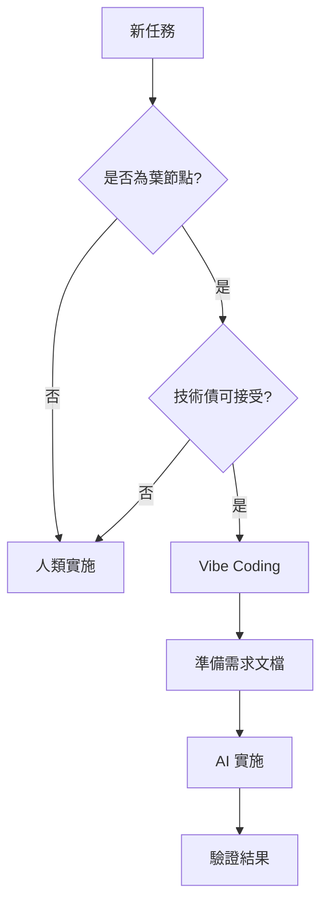

# Vibe Coding 指南：在生產環境中安全地擁抱 AI

## 什麼是 Vibe Coding？

Vibe Coding 是一種新的開發範式，開發者將控制權交給 AI，專注於高層次的產品需求而非底層實施細節。關鍵在於「忘記程式碼的存在，但不忘記產品的存在」。

## 核心原則

### 1. 🍃 葉節點 vs 🌳 核心架構

**葉節點（適合 Vibe Coding）**：
- 獨立的功能模組
- 沒有其他組件依賴的程式碼
- UI 組件、工具函數、獨立的 API 端點
- 測試程式碼、文檔生成、數據轉換

**核心架構（需要人類掌控）**：
- 系統架構設計
- 數據模型和資料庫結構
- 認證和授權系統
- 核心業務邏輯
- 性能關鍵路徑

### 2. 🎯 成為 AI 的產品經理

**提供充足的上下文**：
```markdown
# 功能需求文檔範例
## 背景
[解釋為什麼需要這個功能]

## 需求規格
[詳細的功能需求]

## 約束條件
- 必須使用現有的認證系統
- 需要支援手機端
- 響應時間 < 200ms

## 驗收標準
[可測試的具體標準]
```

**花時間準備，節省實施時間**：
- 15-20 分鐘準備完整的需求文檔
- 探索相關程式碼，理解現有模式
- 與 AI 共同制定實施計畫

### 3. ✅ 驗證而非審查

**建立可驗證的檢查點**：
```python
# 驗證框架範例
class FeatureValidator:
    """不需要理解實施細節即可驗證功能正確性"""
    
    def validate_inputs_outputs(self):
        """驗證輸入輸出的正確性"""
        pass
    
    def validate_performance(self):
        """驗證性能指標"""
        pass
    
    def validate_security(self):
        """驗證安全要求"""
        pass
    
    def run_stress_tests(self):
        """執行壓力測試"""
        pass
```

**測試驅動的 Vibe Coding**：
1. 先讓 AI 編寫完整的測試套件
2. 審查測試而非實施程式碼
3. 確保測試覆蓋所有關鍵路徑

## 實踐指南

### 步驟 1：識別適合的任務



### 步驟 2：準備完整的上下文

```markdown
# 任務上下文模板
## 任務目標
[明確的目標描述]

## 現有程式碼參考
- 類似功能：[路徑]
- 使用的模式：[描述]
- 相關 API：[文檔連結]

## 限制和約束
- 不可修改：[核心檔案列表]
- 必須遵循：[架構原則]
- 性能要求：[具體指標]

## 成功標準
- [ ] 功能測試通過
- [ ] 性能達標
- [ ] 無安全漏洞
- [ ] 程式碼風格一致
```

### 步驟 3：建立驗證策略

**端到端測試優先**：
```javascript
// 範例：E2E 測試比實施更重要
describe('User Registration Flow', () => {
  it('should handle successful registration', async () => {
    // 測試正常路徑
  });
  
  it('should validate email format', async () => {
    // 測試驗證邏輯
  });
  
  it('should handle duplicate emails', async () => {
    // 測試錯誤處理
  });
  
  it('should complete within 2 seconds', async () => {
    // 測試性能要求
  });
});
```

### 步驟 4：迭代改進

**回饋循環**：
1. 截圖或記錄實際輸出
2. 提供給 AI 進行改進
3. 重複直到滿足所有驗收標準

## 風險管理

### ⚠️ 警告信號

- 修改核心架構的需求
- 缺乏清晰的驗收標準
- 無法建立有效的測試
- 涉及敏感數據或安全功能
- 性能關鍵路徑

### 🛡️ 安全措施

1. **版本控制**：頻繁提交，便於回滾
2. **隔離環境**：在獨立分支或環境中測試
3. **人工審查門檻**：核心變更必須人工審查
4. **監控和告警**：部署後密切監控

## 案例研究

### 成功案例：22,000 行程式碼變更

**背景**：大型功能重構專案

**方法**：
1. 2 天人工準備需求和計畫
2. 識別所有葉節點組件
3. 建立完整的驗證框架
4. AI 實施，人類驗證

**結果**：
- 時間節省：80%
- 信心水平：與手寫程式碼相同
- 技術債：集中在可接受的葉節點

### 失敗案例：核心架構重構

**教訓**：
- 核心架構需要深度理解
- AI 缺乏長期維護視角
- 技術債在核心層不可接受

## 未來展望

### 指數級增長的含義

AI 能力每 7 個月翻倍，意味著：
- 現在：處理 1 小時的任務
- 6 個月後：處理 1 天的任務
- 1 年後：處理 1 週的任務

### 準備擁抱變化

1. **學習成為更好的 AI PM**
2. **建立可驗證的系統架構**
3. **保持對核心技術的理解**
4. **接受快速實驗和迭代**

## 總結

Vibe Coding 不是放棄控制，而是在正確的抽象層級上保持控制。透過識別葉節點、提供充足上下文、建立驗證策略，我們可以安全地利用 AI 的指數級能力，同時保持對產品品質和架構完整性的掌控。

記住：**忘記程式碼的存在，但永遠不要忘記產品的存在。**