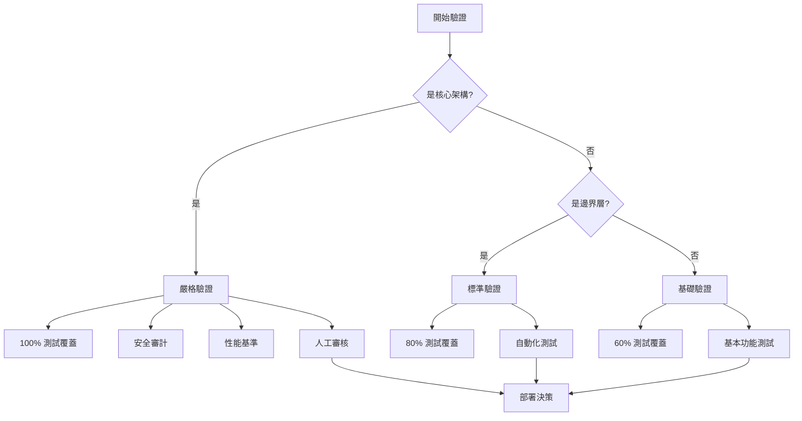

# 驗證測試模板 - Vibe Coding

## 概述
本模板用於驗證 AI 生成的代碼，確保符合 Vibe Coding 原則。

## E2E 測試優先模板

### 1. 功能驗證測試
```javascript
// tests/e2e/feature-name.test.js
describe('Feature: [功能名稱]', () => {
  describe('User Journey', () => {
    it('should complete main user flow', async () => {
      // Given: 初始狀態
      await setupInitialState();
      
      // When: 用戶操作
      await performUserAction();
      
      // Then: 驗證結果
      await verifyExpectedOutcome();
    });
  });
  
  describe('Edge Cases', () => {
    it('should handle error gracefully', async () => {
      // 錯誤場景測試
    });
  });
});
```

### 2. 性能基準測試
```javascript
// tests/performance/benchmark.test.js
describe('Performance Benchmarks', () => {
  it('should meet response time requirements', async () => {
    const startTime = performance.now();
    
    await performOperation();
    
    const endTime = performance.now();
    const duration = endTime - startTime;
    
    expect(duration).toBeLessThan(100); // 100ms threshold
  });
  
  it('should handle concurrent requests', async () => {
    const requests = Array(100).fill().map(() => 
      makeRequest()
    );
    
    const results = await Promise.all(requests);
    const successRate = results.filter(r => r.success).length / 100;
    
    expect(successRate).toBeGreaterThan(0.95); // 95% success rate
  });
});
```

### 3. 安全驗證測試
```javascript
// tests/security/validation.test.js
describe('Security Validation', () => {
  it('should sanitize user input', () => {
    const maliciousInput = '<script>alert("XSS")</script>';
    const sanitized = sanitizeInput(maliciousInput);
    
    expect(sanitized).not.toContain('<script>');
  });
  
  it('should enforce authentication', async () => {
    const response = await makeUnauthenticatedRequest();
    
    expect(response.status).toBe(401);
  });
  
  it('should rate limit requests', async () => {
    const requests = Array(10).fill().map(() => 
      makeRequest()
    );
    
    const responses = await Promise.all(requests);
    const rateLimited = responses.some(r => r.status === 429);
    
    expect(rateLimited).toBe(true);
  });
});
```

## 驗證檢查清單

### 功能驗證 ✅
- [ ] 主要用戶流程測試通過
- [ ] 邊界情況處理正確
- [ ] 錯誤消息清晰友好
- [ ] 數據一致性維護

### 性能驗證 ⚡
- [ ] 響應時間 < 100ms
- [ ] 並發處理能力達標
- [ ] 內存使用合理
- [ ] 無內存洩漏

### 安全驗證 🔒
- [ ] 輸入驗證完整
- [ ] 無 SQL 注入風險
- [ ] 無 XSS 漏洞
- [ ] 認證授權正確

### 代碼質量 📝
- [ ] 測試覆蓋率 > 80%
- [ ] 無 linting 錯誤
- [ ] 類型檢查通過
- [ ] 文檔完整

## 自動化驗證腳本

### 完整驗證流程
```bash
#!/bin/bash
# scripts/verify-all.sh

echo "🔍 開始完整驗證..."

# 1. 代碼質量檢查
echo "📝 檢查代碼質量..."
npm run lint
npm run type-check

# 2. 單元測試
echo "🧪 運行單元測試..."
npm run test:unit

# 3. 集成測試
echo "🔗 運行集成測試..."
npm run test:integration

# 4. E2E 測試
echo "🌐 運行 E2E 測試..."
npm run test:e2e

# 5. 性能測試
echo "⚡ 運行性能測試..."
npm run test:performance

# 6. 安全掃描
echo "🔒 運行安全掃描..."
npm audit
npm run test:security

# 7. 測試覆蓋率
echo "📊 生成覆蓋率報告..."
npm run test:coverage

echo "✅ 驗證完成！"
```

### CI/CD 集成
```yaml
# .github/workflows/verify.yml
name: Verification Pipeline

on:
  pull_request:
    branches: [main]

jobs:
  verify:
    runs-on: ubuntu-latest
    
    steps:
      - uses: actions/checkout@v2
      
      - name: Setup Node.js
        uses: actions/setup-node@v2
        with:
          node-version: '18'
          
      - name: Install dependencies
        run: npm ci
        
      - name: Run verification
        run: ./scripts/verify-all.sh
        
      - name: Upload coverage
        uses: codecov/codecov-action@v2
```

## 驗證報告模板

```markdown
# 驗證報告 - [功能名稱]

## 執行摘要
- **日期**: YYYY-MM-DD
- **版本**: v1.0.0
- **執行者**: AI Assistant

## 測試結果

### ✅ 通過的測試
- [x] 功能測試 (15/15)
- [x] 性能測試 (5/5)
- [x] 安全測試 (8/8)

### ❌ 失敗的測試
- [ ] 邊界測試 (2/3) - 1 個失敗

### ⚠️ 警告
- 測試覆蓋率 78% (目標 80%)
- 響應時間 95ms (接近 100ms 閾值)

## 建議改進
1. 增加邊界情況處理
2. 優化數據庫查詢
3. 增加錯誤日誌

## 風險評估
- **低風險**: 可以部署到測試環境
- **建議**: 修復失敗測試後再部署生產
```

## 驗證策略決策樹



## 最佳實踐

### 1. 測試金字塔
- **70%** 單元測試（快速、隔離）
- **20%** 集成測試（組件交互）
- **10%** E2E 測試（用戶流程）

### 2. 測試命名
```javascript
// ✅ 好的命名
it('should return 404 when user not found', ...)

// ❌ 不好的命名
it('test user', ...)
```

### 3. 測試數據
```javascript
// 使用工廠函數
const createTestUser = (overrides = {}) => ({
  id: 'test-123',
  name: 'Test User',
  email: 'test@example.com',
  ...overrides
});
```

### 4. 測試隔離
```javascript
beforeEach(() => {
  // 重置數據庫
  // 清理緩存
  // 重置 mock
});

afterEach(() => {
  // 清理資源
});
```

## 相關資源

- [測試最佳實踐](../guides/testing-best-practices.md)
- [性能測試指南](../guides/performance-testing.md)
- [安全測試清單](../security/testing-checklist.md)
- [CI/CD 配置](../ci-cd/)

---

*版本: 1.0.0*
*最後更新: 2025-01-19*