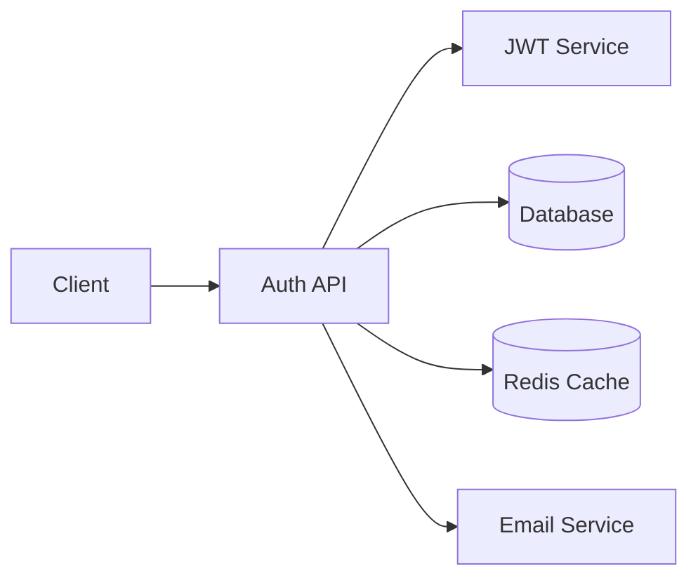

# EPE 工作流程完整教程

## 📚 課程目標

完成本教程後，您將能夠：
1. 理解 EPE (Explore-Plan-Execute) 的核心理念
2. 熟練使用 EPE 命令進行開發
3. 根據不同場景選擇合適的 EPE 策略
4. 整合 EPE 到日常開發流程

## 第一課：EPE 基礎概念

### 什麼是 EPE？

EPE 是一個三階段的系統化開發方法：

```
Explore (探索) → Plan (計劃) → Execute (執行) → Verify (驗證)
    20-30分鐘      10-15分鐘     漸進實施       多層驗證
```

### 為什麼使用 EPE？

傳統方法的問題：
- ❌ 急於開始編碼，缺乏全局理解
- ❌ 忽視現有代碼，重複造輪子
- ❌ 沒有清晰計劃，返工率高

EPE 的優勢：
- ✅ 深度理解需求和現有系統
- ✅ 制定可執行的詳細計劃
- ✅ 有序實施，降低風險
- ✅ 全面驗證，確保質量

## 第二課：Explore 階段詳解

### 探索的目標

```python
exploration_goals = {
    "understand": "深入理解需求本質",
    "discover": "發現現有資源和限制",
    "identify": "識別潛在風險和挑戰",
    "map": "繪製系統依賴關係圖"
}
```

### 實戰演練 1：探索用戶認證需求

```bash
# 啟動探索
/explore user-authentication

# AI 將自動執行以下步驟：
```

#### 1. 需求分析 (5分鐘)
```markdown
## 需求理解
- 核心需求：用戶註冊、登錄、會話管理
- 隱含需求：安全性、性能、用戶體驗
- 約束條件：GDPR合規、移動端支持
```

#### 2. 代碼庫掃描 (10分鐘)
```python
# AI 自動搜索相關代碼
existing_auth = search_codebase([
    "auth", "login", "user", "session",
    "password", "token", "jwt"
])

# 發現：
# - 現有 User 模型在 models/user.js
# - 工具函數在 utils/crypto.js
# - 可重用的中間件在 middleware/
```

#### 3. 依賴分析 (5分鐘)
```javascript
dependencies = {
    external: ["bcrypt", "jsonwebtoken", "express-session"],
    internal: ["database", "email-service", "logger"],
    potential: ["oauth2", "passport", "speakeasy"]
}
```

#### 4. 風險識別 (5分鐘)
```yaml
risks:
  high:
    - SQL注入攻擊
    - 密碼洩露風險
    - Session劫持
  medium:
    - 性能瓶頸（大量並發登錄）
    - 第三方服務依賴
  low:
    - UI/UX一致性
    - 瀏覽器兼容性
```

#### 5. 探索報告
```markdown
# 探索報告：用戶認證系統

## 關鍵發現
1. **可重用資源**：現有 User 模型可直接使用
2. **技術選型**：JWT 優於 Session (無狀態、可擴展)
3. **安全考慮**：需要實施速率限制和 2FA
4. **性能優化**：使用 Redis 快取 session

## 建議架構


## 下一步
進入計劃階段，制定詳細實施方案
```

### 練習：探索您的功能

```bash
# 選擇一個您要開發的功能
/explore [your-feature-name]

# 觀察 AI 的探索過程
# 注意它如何：
# 1. 分解需求
# 2. 搜索現有代碼
# 3. 識別依賴
# 4. 評估風險
```

## 第三課：Plan 階段詳解

### 計劃的要素

```python
planning_elements = {
    "breakdown": "任務分解",
    "sequence": "執行順序",
    "estimation": "時間估算",
    "resources": "資源分配",
    "mitigation": "風險緩解"
}
```

### 實戰演練 2：制定實施計劃

```bash
# 基於探索結果制定計劃
/plan user-authentication
```

#### 生成的計劃示例

```markdown
# 實施計劃：用戶認證系統

## 任務分解

### Phase 1: 基礎設施 (4小時)
- [ ] TASK-001: 設計數據庫架構 (1h)
- [ ] TASK-002: 配置 Redis (0.5h)
- [ ] TASK-003: 設置 JWT 服務 (1h)
- [ ] TASK-004: 創建基礎中間件 (1.5h)

### Phase 2: 核心功能 (6小時)
- [ ] TASK-005: 用戶註冊 API (2h)
- [ ] TASK-006: 登錄/登出 API (2h)
- [ ] TASK-007: 密碼重置流程 (2h)

### Phase 3: 安全增強 (4小時)
- [ ] TASK-008: 實施速率限制 (1h)
- [ ] TASK-009: 添加 2FA 支持 (2h)
- [ ] TASK-010: 安全審計日誌 (1h)

### Phase 4: 測試驗證 (2小時)
- [ ] TASK-011: 單元測試 (1h)
- [ ] TASK-012: 集成測試 (0.5h)
- [ ] TASK-013: 安全測試 (0.5h)

## 執行策略

```mermaid
gantt
    title 實施時間線
    dateFormat HH:mm
    section Phase 1
    數據庫設計     :t1, 00:00, 1h
    Redis配置      :t2, after t1, 30m
    JWT服務        :t3, 00:00, 1h
    中間件         :t4, after t2, 90m
    
    section Phase 2
    註冊API        :t5, after t4, 2h
    登錄API        :t6, after t5, 2h
    密碼重置       :t7, after t6, 2h
```



## 風險緩解策略

| 風險 | 緩解措施 |
|------|----------|
| SQL注入 | 使用參數化查詢，ORM驗證 |
| 密碼安全 | bcrypt加密，最小12輪 |
| Token洩露 | 短期Token，Refresh機制 |
| 並發問題 | 連接池，隊列處理 |

## 成功標準
- [ ] 所有測試通過 (100%)
- [ ] 安全掃描無高危漏洞
- [ ] 響應時間 < 200ms
- [ ] 並發支持 > 1000 用戶
```

### 計劃優化技巧

```python
# 1. 識別關鍵路徑
critical_path = identify_critical_path(tasks)
print(f"關鍵路徑長度: {critical_path.duration} 小時")

# 2. 並行機會
parallel_tasks = find_parallel_opportunities(tasks)
print(f"可並行任務組: {len(parallel_tasks)} 組")

# 3. 資源優化
optimized_allocation = optimize_resources(tasks, available_resources)
```

## 第四課：Execute 階段詳解

### 執行的原則

```yaml
execution_principles:
  discipline: 嚴格按計劃執行
  quality: 每步都要驗證
  incremental: 小步快跑
  feedback: 快速反饋循環
```

### 實戰演練 3：執行實施

```bash
# 開始執行
/execute user-authentication

# 或執行特定任務
/execute TASK-001
```

#### 執行過程示例

```python
# Step 1: 數據庫設計
def execute_task_001():
    """設計數據庫架構"""
    
    # 1. 創建 schema
    create_schema = """
    CREATE TABLE users (
        id UUID PRIMARY KEY DEFAULT gen_random_uuid(),
        email VARCHAR(255) UNIQUE NOT NULL,
        password_hash VARCHAR(255) NOT NULL,
        created_at TIMESTAMP DEFAULT CURRENT_TIMESTAMP,
        updated_at TIMESTAMP DEFAULT CURRENT_TIMESTAMP
    );
    
    CREATE TABLE sessions (
        id UUID PRIMARY KEY DEFAULT gen_random_uuid(),
        user_id UUID REFERENCES users(id),
        token VARCHAR(500) NOT NULL,
        expires_at TIMESTAMP NOT NULL,
        created_at TIMESTAMP DEFAULT CURRENT_TIMESTAMP
    );
    
    CREATE INDEX idx_sessions_token ON sessions(token);
    CREATE INDEX idx_sessions_user ON sessions(user_id);
    """
    
    # 2. 創建 ORM 模型
    create_models()
    
    # 3. 運行遷移
    run_migration()
    
    # 4. 驗證
    verify_database_setup()
    
    return {
        "status": "completed",
        "duration": "55 minutes",
        "files_created": ["migrations/001_auth.sql", "models/User.js"],
        "next_task": "TASK-002"
    }
```

### 執行監控

```bash
# 查看執行進度
/task-status

# 輸出：
╔════════════════════════════════════╗
║ 執行進度：用戶認證系統             ║
╠════════════════════════════════════╣
║ Phase 1: ████████████████ 100%     ║
║ Phase 2: ████████░░░░░░░  50%      ║
║ Phase 3: ░░░░░░░░░░░░░░░   0%      ║
║ Phase 4: ░░░░░░░░░░░░░░░   0%      ║
╠════════════════════════════════════╣
║ 總進度: 37.5% | 預計剩餘: 10小時   ║
╚════════════════════════════════════╝
```

## 第五課：Verify 階段詳解

### 驗證的層次

```python
verification_layers = [
    "unit_tests",      # 單元測試
    "integration",     # 集成測試
    "e2e",            # 端到端測試
    "security",       # 安全測試
    "performance",    # 性能測試
    "user_acceptance" # 用戶驗收
]
```

### 實戰演練 4：全面驗證

```bash
# 執行驗證
/verify user-authentication --comprehensive
```

#### 驗證報告示例

```markdown
# 驗證報告：用戶認證系統

## 測試結果摘要
- ✅ 單元測試: 45/45 通過
- ✅ 集成測試: 12/12 通過
- ✅ E2E測試: 8/8 通過
- ⚠️ 安全測試: 1 個中等風險
- ✅ 性能測試: 滿足所有指標

## 詳細結果

### 單元測試覆蓋率
- 總覆蓋率: 92%
- 關鍵路徑: 100%
- 邊界情況: 85%

### 安全掃描
```
┌─────────────────────────────────┐
│ 發現 1 個中等風險               │
├─────────────────────────────────┤
│ 類型: 信息洩露                  │
│ 位置: /api/auth/error-handler   │
│ 描述: 錯誤消息可能洩露系統信息  │
│ 建議: 使用通用錯誤消息          │
└─────────────────────────────────┘
```

### 性能基準
| 指標 | 目標 | 實際 | 狀態 |
|------|------|------|------|
| 登錄響應時間 | <200ms | 145ms | ✅ |
| 並發用戶 | >1000 | 1500 | ✅ |
| Token生成 | <50ms | 32ms | ✅ |
| 數據庫查詢 | <10ms | 7ms | ✅ |

## 建議改進
1. 修復安全風險：統一錯誤消息
2. 提升測試覆蓋率到 95%
3. 添加更多邊界測試案例
```

## 第六課：場景實踐

### 場景 1：快速原型開發

```bash
# 使用簡化流程
/spec-init-simple landing-page "產品落地頁"

# 快速探索 (5分鐘)
# → 發現可用模板
# → 識別所需組件

# 立即執行
# → AI 自主開發（葉節點）
# → 基礎驗證
```

### 場景 2：複雜系統重構

```bash
# 完整 EPE 流程
/spec-init payment-refactor "支付系統重構"

# 深度探索 (30分鐘)
/explore payment-refactor --deep

# 詳細規劃 (15分鐘)
/plan payment-refactor --risk-analysis

# 分階段執行
/task-split payment-refactor --strategy sequential
/execute payment-refactor --phase 1

# 嚴格驗證
/verify payment-refactor --level strict
```

### 場景 3：緊急 Bug 修復

```bash
# 快速診斷
/explore bug-fix --quick

# 立即計劃
/plan bug-fix --emergency

# 快速修復
/execute bug-fix --hotfix

# 回歸測試
/verify bug-fix --regression
```

## 第七課：最佳實踐

### 1. 選擇合適的 EPE 模式

```python
def select_epe_mode(task):
    if task.complexity < 3:
        return "simple"  # 5-10分鐘快速流程
    elif task.risk_level == "high":
        return "comprehensive"  # 完整30分鐘探索
    elif task.type == "bugfix":
        return "focused"  # 針對性探索
    else:
        return "standard"  # 標準流程
```

### 2. 探索階段不要跳過

即使是簡單任務，5分鐘的探索也能：
- 發現可重用代碼
- 避免重複工作
- 識別潛在問題

### 3. 計劃要可執行

好的計劃應該：
- 任務粒度適中（1-4小時）
- 依賴關係清晰
- 包含驗證標準
- 有風險預案

### 4. 執行要有紀律

```python
execution_discipline = {
    "follow_plan": "嚴格按計劃執行",
    "test_each_step": "每步都要測試",
    "document_changes": "記錄所有變更",
    "communicate": "及時溝通問題"
}
```

### 5. 驗證要全面

```bash
# 不同級別的驗證
/verify feature --level basic    # 葉節點
/verify feature --level standard # 邊界層
/verify feature --level strict   # 核心架構
```

## 第八課：故障排除

### 常見問題

#### Q1: 探索階段耗時過長？
```bash
# 使用時間限制
/explore feature --time-limit 15m

# 或使用快速模式
/explore feature --quick
```

#### Q2: 計劃過於複雜？
```bash
# 使用任務分解
/task-split complex-feature --max-size 3

# 生成簡化計劃
/plan feature --simplified
```

#### Q3: 執行遇到阻塞？
```bash
# 查看阻塞原因
/task-status --show-blockers

# 調整執行策略
/execute feature --skip-blocked
```

#### Q4: 驗證失敗如何處理？
```bash
# 查看失敗詳情
/verify feature --show-failures

# 自動修復
/verify feature --auto-fix

# 重新驗證
/verify feature --rerun-failed
```

## 實踐作業

### 作業 1：完整 EPE 流程
選擇一個中等複雜度的功能，完成完整的 EPE 流程：
1. 探索 (記錄發現)
2. 計劃 (評估可行性)
3. 執行 (實施第一階段)
4. 驗證 (運行測試)

### 作業 2：優化現有流程
檢查您當前的開發流程，識別可以應用 EPE 的地方：
- 哪些步驟可以自動化？
- 探索階段能發現什麼？
- 如何改進計劃質量？

### 作業 3：創建自定義 EPE 模板
為您的特定領域創建 EPE 模板：
```python
custom_epe_template = {
    "explore": {
        "duration": "自定義",
        "focus_areas": ["特定領域"],
        "tools": ["專用工具"]
    },
    "plan": {
        "template": "您的模板",
        "criteria": "成功標準"
    },
    "execute": {
        "strategy": "執行策略",
        "checkpoints": "檢查點"
    }
}
```

## 總結

EPE 工作流程的核心價值：
1. **理解先於編碼**：深度探索避免返工
2. **計劃驅動執行**：有序開發降低風險
3. **持續驗證質量**：及早發現和修復問題
4. **適應不同場景**：靈活調整流程深度

## 進階資源

- [EPE 命令參考](../commands/epe-reference.md)
- [EPE 與 SDD 整合](../guides/epe-sdd-integration.md)
- [EPE 自動化腳本](../scripts/epe-automation.md)
- [EPE 最佳實踐集](../best-practices/epe.md)

---

*教程版本: 1.0.0*
*最後更新: 2025-01-19*
*預計學習時間: 2-3小時*

**需要幫助？** 在實踐中遇到問題，請參考 [EPE FAQ](../faq/epe.md) 或提交問題。